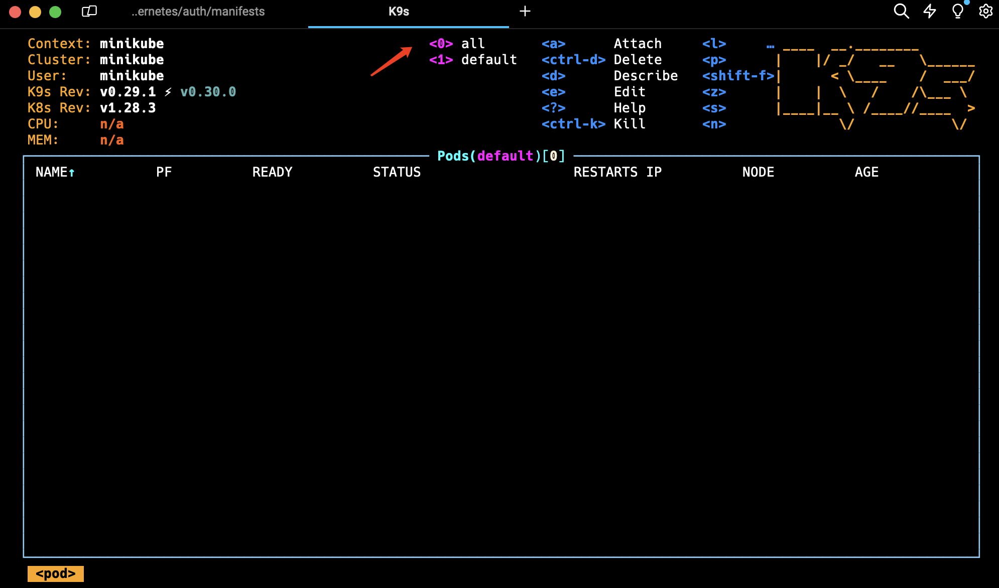
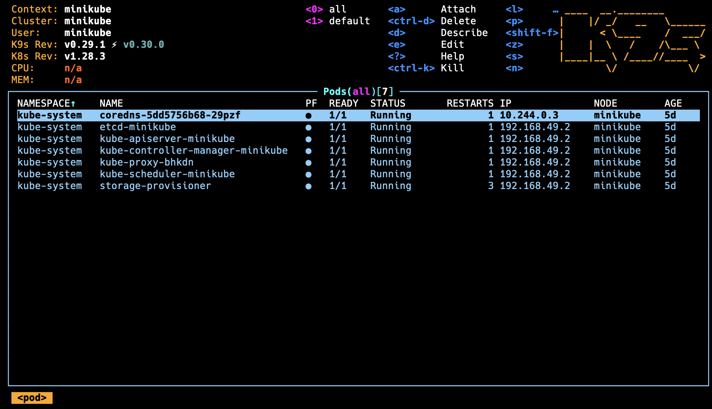

# opsprod

We will be building the backend of the system first. 

Create a directory for backend and cd into it.

```
mkdir backend
cd backend
```

Create a virtual env within op-backend.

```
python3 -m venv venv
```

Activate virtual env.

```
source ./venv/bin/activate
```

First, ensure you have FastAPI and an ASGI server like `uvicorn` installed. You can install them using pip:

```
pip3 install fastapi uvicorn
```

Now, create a Python file for your application, for example, `main.py`, and add the following code:

```
from fastapi import FastAPI

app = FastAPI()

@app.get("/")
async def read_root():
    return {"Hello": "World"}

```

This code creates a FastAPI instance and defines a single GET route that returns a JSON response.

To run this application, use `uvicorn` and specify the host and port. By default, FastAPI applications run on port 8000, but you can change it to any port you prefer. For example, to run on port 5001:
```
uvicorn main:app --host 0.0.0.0 --port 5001
```

This command tells `uvicorn` to run the FastAPI app defined in `main.py` (`main:app`) and listen on all interfaces (`0.0.0.0`) on port `5001`.

When you run this command, you should see output indicating that the server is running. You can then access the application by going to `http://localhost:5001` in your web browser or using a tool like `curl`:

```
curl http://localhost:5001
```

This will return:
```
{"Hello": "World"
```

Install below in your local environment:

1. Install Docker for Desktop
2. Install kubectl
3. Install minikube
4. Install K9s
5. Install Python 3

Once installed, run below in terminal:
```
minikube start
```

(Optional) If you have used minikube in your previous project, you will need to run below command to have a fresh start in minikube. If your minikube is still running, run `minikube stop` frirst, else just run  `minikube delete` and `minikube start`.
```
minikube stop 
minikube delete
minikube start
```

Let's create our `requirements.txt`.
```
pip3 freeze > requirements.txt
```

Create a docker file.
```
touch Dockerfile
```

Copy the below to dockerfile . Save and exit.
```
# Use an official Python runtime as a parent image
FROM python:3.8

# Set the working directory in the container
WORKDIR /usr/src/app

# Copy the dependencies file to the working directory
COPY requirements.txt ./

# Install any dependencies
RUN pip install --no-cache-dir -r requirements.txt

# Copy the content of the local src directory to the working directory
COPY . .

# Inform Docker that the container is listening on the specified port at runtime.
EXPOSE 5001

# Command to run the application
CMD ["uvicorn", "main:app", "--host", "0.0.0.0", "--port", "5001"]
```

Next, make a directory named `manifests`. This directory is going to contain all of the `op-backend` service's kubernetes configuration. 
```
mkdir manifests
```

Change directory to manifests. 
```
cd manifests
```

Create an `op-backend-deploy.yaml` file with the below content.
```
apiVersion: apps/v1
kind: Deployment
metadata:
  name: op-backend
  labels:
    app: op-backend
spec:
  replicas: 1
  selector:
    matchLabels:
      app: op-backend
  strategy:
    type: RollingUpdate
    rollingUpdate:
      maxSurge: 2
  template:
    metadata:
      labels:
        app: op-backend
    spec:
      containers:
        - name: op-backend
          image: kaitan8110/op-backend
          ports:
            - containerPort: 5001
          envFrom:
            - configMapRef:
                name: op-backend-configmap
            - secretRef:
                name: op-backend-secret
```

Create a `configmap.yaml` file with the below content.
```
apiVersion: v1
kind: ConfigMap
metadata:
  name: op-backend-configmap
data:
  PLACEHOLDER: "NONE"
```

Create a `secret.yaml` file with the below content. (Usually, we don't push this file to the remote github repository as it contains application's sensitive information. Especially in a production environment.)
```
apiVersion: v1
kind: Secret
metadata:
  name: op-backend-secret
stringData:
  PLACEHOLDER: "NONE"
type: Opaque
```

Create a `service.yaml` file with the below content.
```
apiVersion: v1
kind: Service
metadata:
  name: op-backend
spec:
  selector:
    app: op-backend
  type: ClusterIP
  ports:
    - port: 5001
      targetPort: 5001
      protocol: TCP
```

Create a `ingress.yaml` file. (To allow traffic to access our backend endpoint)
```
vim ingress.yaml
```

Fill in below code. Save and exit. 
```
apiVersion: networking.k8s.io/v1
kind: Ingress
metadata:
  name: backend-ingress
  annotations:
    nginx.ingress.kubernetes.io/proxy-body-size: "0"
    nginx.ingress.kubernetes.io/proxy-read-timeout: "600"
    nginx.ingress.kubernetes.io/proxy-sent-timeout: "600"
spec:
  rules:
    - host: opsprod.com
      http:
        paths:
          - path: /
            pathType: Prefix
            backend:
              service:
                name: op-backend
                port:
                  number: 5001
```

To make sure that `opsprod.com` get routed to localhost, we need to edit a `hosts` file in your local setup. 
```
sudo vim /etc/hosts
```

Add a new line below to `hosts` file. Save and exit. 
```
127.0.0.1 opsprod.com
```

We will now need to configure a minikube add-on to allow ingress. Run below command in your local environment to list the addons that minikube have. 
```
minikube addons list
```

Next, run below command to enable `ingress` addon. 
```
minikube addons enable ingress
```

Basically, whenever we want to test this microservice architecture, we will need to run the `minikube tunnel` command. And when this is running, whenever we send request to our loopback address, it is going to go to our minikube cluster via the ingress. And since we map `opsprod.com` to our loopback address, if we send request to `opsprod.com`, they are going to go to this minikube tunnel. 
```
minikube tunnel
```

Now that we have all our infrastructure code for our kubernetes deployment, we can actually start to deploy this `op-backend` service to our cluster. 

Start Docker Desktop. Then start minikube. (If you have not yet started)
```
minikube start
```

Enter into K9s. 
```
K9s
```

Change the namespace to **all** by hitting `0`. 


We can see our minikube pods running within the kube-system namespace. 


Hit `Ctrl + C` to quit K9s interactive window. 

Fyi, all of the files within this manifests directory, when applied will interface with the kubernetes API. So these files are going to interface with that API, to create our service and its corresponding resources. 

Change to the `manifests` directory. Run the below to apply all the files in the current directory. (`-f` is a flag for files) 
```
kubectl apply -f ./
```

We can see the following kubernetes resources have been created. 
Our op-backend service are running in minikube now.